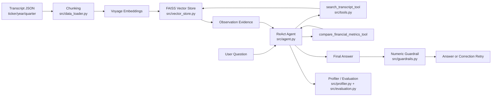

# Financial Intelligence Agentic RAG Engine

Portfolio-grade Agentic RAG system for financial earnings-call analysis. The project combines FAISS transcript retrieval, tool-based ReAct planning, numeric faithfulness guardrails, and RTX 5080 local inference profiling.

## What It Does

- Ingests S&P 500 earnings-call transcript samples with `ticker`, `year`, and `quarter` metadata.
- Builds a FAISS vector index with Voyage finance embeddings.
- Exposes retrieval and metric comparison as tools callable by an LLM agent.
- Runs a ReAct loop: Thought -> Action -> Observation -> Final Answer.
- Applies numeric guardrails before final output to reduce unsupported financial numbers.
- Benchmarks cloud and local generation paths, including Ollama Llama 3.1 8B on an RTX 5080.

## Architecture



```text
data/mini_sp500_transcripts.json
  -> src/data_loader.py
  -> src/vector_store.py
  -> src/tools.py
  -> src/agent.py
  -> src/guardrails.py
  -> src/evaluation.py
  -> src/profiler.py
```

Provider boundary:

```text
Voyage embeddings -> FAISS retrieval -> Claude or Ollama generation
```

Major entry points:

- `main.py`: CLI for index building, search, ask, evaluation, and profiling.
- `src/agent.py`: ReAct agent loop and tool-call parsing.
- `src/tools.py`: Transcript search and metric comparison tools.
- `src/guardrails.py`: Numeric answer faithfulness checks.
- `src/profiler.py`: Latency, concurrency, loop, correction, and GPU memory profiling.

## Setup

```powershell
python -m venv .venv
.\.venv\Scripts\Activate.ps1
pip install -r requirements.txt
```

Create `.env` or set shell variables:

```text
VOYAGE_API_KEY=your_voyage_key
ANTHROPIC_API_KEY=your_anthropic_key
OLLAMA_MODEL=llama3.1:8b
```

Claude is optional when using `--llm-provider ollama`. Voyage is still required for the current embedding path.

## Data And Index

The repo includes a small sample dataset derived from the Hugging Face dataset `glopardo/sp500-earnings-transcripts`:

```text
data/mini_sp500_transcripts.json
```

See `docs/DATA.md` for source attribution, citation guidance, and data-use notes.

Build the local FAISS index after cloning:

```powershell
python main.py build-index --embedding-provider voyage
```

## Run The Agent

Cloud LLM path:

```powershell
python main.py ask "Compare Tesla gross margin in 2024 and 2025." --llm-provider claude --embedding-provider voyage
```

Local RTX/Ollama path:

```powershell
python main.py ask "Compare Tesla gross margin in 2024 and 2025." --llm-provider ollama --embedding-provider voyage --max-loops 3 --max-corrections 1
```

Search only:

```powershell
python main.py search "What did Apple say about services revenue growth?" --ticker AAPL --year 2023
```

## Evaluation

```powershell
python main.py eval --llm-provider ollama --embedding-provider voyage
```

Evaluation cases live in:

```text
eval_cases/day3_agentic_smoke.json
```

The evaluation harness tracks runtime errors, guardrail pass rate, expected metadata hits, expected tool calls, required terms, loop counts, correction attempts, and latency.

The current evaluation pipeline does not report classic `Precision@3` as a named metric. Instead, it uses Agentic RAG-specific checks:

- expected metadata hit rate
- expected tool calls hit rate
- expected tool call query hit rate
- required answer terms hit rate
- numeric guardrail pass rate
- success rate across those checks

## RTX 5080 Profiling

```powershell
python main.py profile-sweep --llm-provider ollama --embedding-provider voyage --concurrency-values 1,2,4,8,16 --category simple
python main.py profile-sweep --llm-provider ollama --embedding-provider voyage --concurrency-values 1,2,4,8,16 --category comparison
```

Final curated reports:

```text
benchmarks/5080/
```

Final readout:

- `concurrency=4` is the current RTX 5080 sweet spot.
- Final simple sweep: `0%` runtime errors, `100%` numeric guardrail pass rate.
- Final comparison sweep: `0%` runtime errors, `100%` numeric guardrail pass rate.
- Higher concurrency did not improve throughput and increased tail latency on the simple sweep.

| Sweep | Cases | Best Concurrency | Throughput | p95 | p99 | Runtime Errors | Guardrail |
|---|---:|---:|---:|---:|---:|---:|---:|
| simple | 6 | 4 | 0.382/s | 10.44s | 10.67s | 0% | 100% |
| comparison | 2 | 4 | 0.367/s | 5.39s | 5.43s | 0% | 100% |

## Demo

See:

```text
docs/DEMO.md
```

## Project Report

See:

```text
docs/PROJECT_REPORT.md
```
